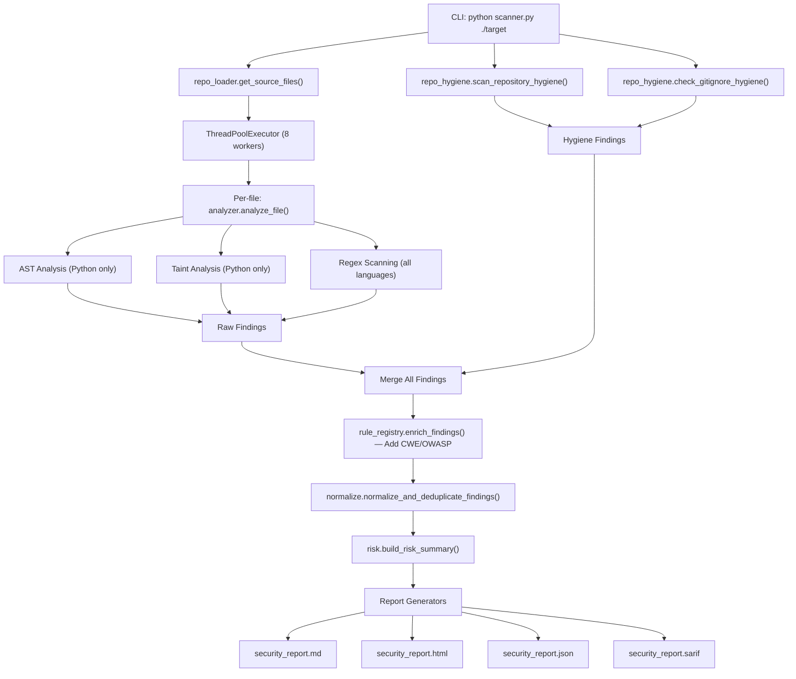

# Risk Ripple — Complete Project Walkthrough

## 1. What Is This Project?

A **rule-based Static Application Security Testing (SAST)** tool and **repository hygiene scanner** for local source code. It scans a directory for security vulnerabilities and bad practices, then produces reports in 4 formats: Markdown, HTML, JSON, and SARIF.

**Key characteristics:**
- Pure Python, no ML — deterministic, explainable, auditable
- Supports `.py`, `.js`, `.ts`, `.java`, `.go`, `.php`, `.rb`, `.c`, `.cpp`
- Three detection engines: **AST analysis**, **regex pattern matching**, **taint analysis**
- Plus a **repository hygiene** scanner (secrets, `.gitignore` gaps, sensitive files)
- Optional AI-assisted review via OpenAI (not required)

---

## 2. Project Structure

```
ai-repo-security-scanner-main/
├── scanner.py              ← CLI entry point (main)
├── pyproject.toml           ← Package config, dependencies, CLI script
├── requirements.txt         ← Minimal deps (PyYAML, Flask)
├── core/                    ← Core scanning engine
│   ├── analyzer.py          ← File analysis orchestrator (AST + regex)
│   ├── taint_analysis.py    ← Intra-procedural taint tracking
│   ├── rules_engine.py      ← Loads all regex rules from rule modules
│   ├── rule_registry.py     ← YAML metadata registry + finding enrichment
│   ├── repo_hygiene.py      ← Sensitive file/secret/gitignore scanning
│   ├── risk.py              ← Risk scoring model (repo + file level)
│   ├── severity.py          ← Canonical severity levels & weights
│   ├── normalize.py         ← Finding normalization & deduplication
│   ├── ai_review.py         ← Optional AI review orchestration
│   ├── ai_provider.py       ← AI provider adapter (Gemini via REST)
│   ├── git_context.py       ← Git tracked/ignored classification
│   └── secrets_detection.py ← Shared credential patterns
├── rules/                   ← Detection rule definitions
│   ├── python_rules.py      ← eval/exec regex fallbacks (non-Python files)
│   ├── secrets_rules.py     ← Hardcoded passwords, API keys, tokens, PEM keys
│   ├── crypto_rules.py      ← MD5, SHA1, insecure random
│   ├── config_rules.py      ← debug=True, verify=False, legacy SSL
│   └── metadata/rules.yaml  ← Rich rule metadata (CWE, OWASP, remediation)
├── io_utils/                ← File I/O utilities
│   ├── repo_loader.py       ← Walk directory, collect source files
│   └── file_loader.py       ← Priority-sorted file collection for AI review
├── reports/                 ← Report generators
│   ├── html_report.py       ← Standalone dark-themed HTML dashboard
│   ├── markdown_report.py   ← Audit-style markdown report
│   ├── json_report.py       ← Machine-readable JSON export
│   └── sarif_report.py      ← SARIF 2.1.0 for CI/CD integration
├── prompts/                 ← LLM prompt templates
│   └── security_prompts.py  ← System prompt for AI code review
├── tools/                   ← Developer/CI utilities
│   └── check_secrets.py     ← Pre-commit secret scanner
├── tests/                   ← pytest test suite (9 test files)
├── samples/                 ← Intentionally vulnerable sample code
├── benchmark/               ← Safe vs vulnerable benchmark pairs
└── docs/                    ← Documentation
```

---

## 3. Entry Point: `scanner.py`

The CLI registered as `ai-repo-scanner` in [pyproject.toml](file:///c:/Users/happy/Desktop/ai-repo-security-scanner-main/pyproject.toml#L40):

```python
[project.scripts]
ai-repo-scanner = "scanner:main"
```

### The `main()` pipeline has 5 steps:

```
[1/5] Resolve target directory
[2/5] Collect source files (repo_loader.get_source_files)
[3/5] SAST scan — parallel file analysis (ThreadPoolExecutor)
[4/5] Repository hygiene checks (sensitive files + .gitignore)
[5/5] Generate and save reports
```

### CLI Arguments

| Argument | Default | Purpose |
|---|---|---|
| `target` | (required) | Directory to scan |
| `--workers N` | 8 | Parallel scan threads |
| `--format` | `all` | `md`, `html`, `json`, `sarif`, or `all` |
| `--output-dir` | `output` | Where reports are saved |
| `--top-files N` | 5 | Top risky files in summary |
| `--fail-on-severity` | None | Exit code 1 if severity ≥ threshold |
| `--fail-on-score N` | None | Exit code 1 if risk score ≥ N |
| `-v` / `-q` | — | Verbose debug / quiet mode |

### Scanning Flow in `main()`

```python
files = get_source_files(target)                    # Step 2
findings, errors = scan_repository(files, workers)  # Step 3 — parallel SAST
findings += run_hygiene_checks(target)              # Step 4 — hygiene
findings = enrich_findings(findings)                # Add CWE/OWASP metadata
findings = normalize_and_deduplicate_findings(findings)  # Dedupe by fingerprint
```

---

## 4. Detection Engine 1: AST Analysis (`core/analyzer.py`)

**Python-only.** Parses the file into an Abstract Syntax Tree and walks it with `DangerousCallVisitor`.

### What It Detects (7 AST rules)

| Rule ID | Detects | Severity |
|---|---|---|
| PY001 | `eval()` | HIGH |
| PY002 | `exec()` | HIGH |
| PY003 | `os.system()` | HIGH |
| PY004 | `subprocess.run/Popen/call(shell=True)` | HIGH |
| PY005 | `pickle.load()` / `pickle.loads()` | HIGH |
| PY006 | `yaml.load()` | HIGH |
| PY007 | `compile()` | HIGH |

### How It Works

1. `ast.parse(content)` → parse Python source into AST
2. `DangerousCallVisitor` visits every `ast.Call` node
3. Extracts the fully-qualified function name (e.g., `subprocess.run`)
4. For subprocess calls, checks if `shell=True` keyword is present
5. Builds a **code snippet** with ±1 line of context around the finding

### False Positive Prevention

- **Comment-only lines** are detected via `tokenize` and skipped
- **Metadata lines** (lines containing `"title":`, `"description":`, etc.) are filtered out to avoid flagging rule definitions themselves

---

## 5. Detection Engine 2: Regex Scanning (`core/rules_engine.py` + `rules/`)

Line-by-line regex matching across **all supported languages**.

### Rule Modules

**`rules/python_rules.py`** — 2 rules (GEN001, GEN002): regex fallbacks for `eval()`/`exec()` in non-Python files only (`non_python_only: True`).

**`rules/secrets_rules.py`** — 4 rules:

| Rule ID | Pattern |
|---|---|
| SEC001 | Hardcoded passwords (`password = "..."`) |
| SEC002 | Hardcoded API keys/tokens/secrets |
| SEC007 | Bearer tokens in Authorization headers |
| SEC008 | PEM-encoded private key material |

**`rules/crypto_rules.py`** — 3 rules:

| Rule ID | Pattern |
|---|---|
| SEC005 | `hashlib.md5()` usage |
| SEC006 | `hashlib.sha1()` usage |
| SEC009 | `random.randint/random()` for security contexts (Python-only) |

**`rules/config_rules.py`** — 3 rules:

| Rule ID | Pattern |
|---|---|
| SEC003 | `debug=True` (Flask debug mode) |
| SEC004 | `verify=False` (TLS cert verification disabled) |
| SEC010 | Legacy SSL/TLS protocols (SSLv2, SSLv3, TLSv1) |

### How Regex Scanning Works

```python
for line_number, line in enumerate(lines, start=1):
    # Skip blank, comment-only, metadata lines
    for rule in get_all_rules():
        if rule["pattern"].search(line):
            # Create finding with snippet
```

Each rule has `python_only` and `non_python_only` flags to control language applicability.

---

## 6. Detection Engine 3: Taint Analysis (`core/taint_analysis.py`)

**Python-only.** Intra-procedural data-flow tracking: `source → propagation → sink`.

### Sources (where tainted data enters)

- `input()`, `request.args`, `request.form`, `request.json`, `sys.argv`, `os.environ`
- Subscript access: `request.args["key"]`, `request.form.get("key")`

### Sinks (dangerous destinations)

| Sink | Category | Severity |
|---|---|---|
| `os.system()` | Command Injection | HIGH |
| `subprocess.run/Popen/call()` | Command Injection | HIGH |
| `cursor.execute()` / `*.execute()` | SQL Injection | HIGH |
| `open()` | Path Traversal | MEDIUM |

### Sanitizers

`shlex.quote()`, `markupsafe.escape()`, `html.escape()` — if tainted data passes through these, severity is **lowered to LOW**.

### How It Works

The `_TaintVisitor` walks each **function body** statement by statement:

1. **Assignment from source** → mark variable as tainted
2. **Propagation** (`a = b + tainted_var`, f-strings, concatenation) → taint spreads
3. **Sanitizer call** → mark variable as sanitized (but still tainted)
4. **Sink call** → if any argument contains tainted variable names → emit finding
5. **Overwrite** → variable reassigned from clean source → remove taint

### Rule IDs Generated

| Rule ID | Category |
|---|---|
| TAINT-CMD | Command Injection |
| TAINT-SQL | SQL Injection |
| TAINT-PATH | Path Traversal |
| TAINT001 | Generic dangerous sink |

---

## 7. Repository Hygiene (`core/repo_hygiene.py`)

Walks the **entire directory tree** (not just source files) looking for:

### `scan_repository_hygiene()` — File/Directory Checks

| Rule ID | What | Severity |
|---|---|---|
| RH001 | `__pycache__`, `.pytest_cache`, `node_modules` dirs | MEDIUM |
| RH002 | `.env`, `.env.local`, `.env.production`, etc. | HIGH |
| RH003 | Private keys (`id_rsa`, `*.pem`, `*.key`, `*.p12`) | HIGH |
| RH004 | `.pyc` bytecode files | LOW |
| RH004b | `.pyo` bytecode files | LOW |
| RH005 | **Secret patterns in file content** (OpenAI `sk-`, AWS `AKIA`, GitHub `ghp_`) | **CRITICAL** |

### `check_gitignore_hygiene()` — .gitignore Gaps

| Rule ID | What | Severity |
|---|---|---|
| RH010 | Missing required patterns (`.env`, `__pycache__/`, `*.pyc`, `venv/`, etc.) | HIGH |
| RH011 | Reminder that `.gitignore` doesn't untrack already-committed files | MEDIUM |

---

## 8. Rule Registry & Metadata Enrichment (`core/rule_registry.py`)

### Hybrid Architecture

- **Detection logic** lives in Python (AST visitors, regex rules, taint visitor)
- **Rich metadata** lives in [rules/metadata/rules.yaml](file:///c:/Users/happy/Desktop/ai-repo-security-scanner-main/rules/metadata/rules.yaml) (432 lines, 30 rules)

### YAML Metadata Per Rule

```yaml
- rule_id: python-eval-use
  title: Use of eval()
  category: Code Injection
  severity: HIGH
  confidence: HIGH
  detection_type: ast
  language: python
  cwe: CWE-94
  owasp: A03:2021-Injection
  remediation: Avoid eval(). Use safe parsing...
  references:
    - https://cwe.mitre.org/data/definitions/94.html
```

### Legacy ID Mapping

The Python detection code emits short IDs (e.g., `PY001`). The registry maps these to canonical IDs:

```python
LEGACY_RULE_ID_MAP = {
    "PY001": "python-eval-use",
    "SEC001": "secret-hardcoded-password",
    "TAINT-CMD": "command-injection-taint",
    ...
}
```

### `enrich_findings()`

After scanning, each finding is enriched with CWE, OWASP, references, and remediation from the YAML metadata. This is what makes SARIF reports comprehensive.

---

## 9. Risk Scoring Model (`core/risk.py`)

### Severity Weights

| Level | Weight |
|---|---|
| CRITICAL | 10 |
| HIGH | 6 |
| MEDIUM | 3 |
| LOW | 1 |

### Repository Risk Score Formula

```
score = severity_contribution
      + taint_flow_bonus (5 per taint finding)
      + secret_exposure_bonus (6 per secret finding)
      + hygiene_contribution (1.5 per hygiene finding, capped at 15)
      + critical_category_bonus (3 per finding in injection/secrets categories)
      + file_concentration_factor (max 10, based on how concentrated findings are)
      + unique_files_factor (min(5, number_of_affected_files))
```

### Risk Level Thresholds

| Score | Level |
|---|---|
| 0–20 | Low |
| 21–50 | Moderate |
| 51–100 | High |
| >100 | Critical |

### File-Level Scoring

Same severity × confidence weights, plus taint and critical-category bonuses. Used for the "Top Risky Files" ranking.

---

## 10. Normalization & Deduplication (`core/normalize.py`)

Before reporting, all findings go through:

1. **Severity normalization** — unknown values → `LOW`
2. **Confidence normalization** — unknown values → `MEDIUM`
3. **Path normalization** — backslashes → forward slashes
4. **Fingerprinting** — SHA-256 hash of `rule_id|file_path|line_number|title` (first 32 chars)
5. **Deduplication** — first occurrence by fingerprint wins

---

## 11. Report Generation (`reports/`)

### Markdown (`markdown_report.py`)

Audit-style `.md` with: summary table, severity breakdown, top risky files, risk score explanation, hygiene section, taint flow section, all findings with code snippets, scan errors.

### HTML (`html_report.py`)

Self-contained dark-themed dashboard (1019 lines, all CSS inline). Features:
- Summary cards (files scanned, findings, risk score with pill badge)
- Severity distribution bar chart
- Category distribution table
- Risk score breakdown table
- Searchable findings table with `filterFindings()` JS
- Repository hygiene and taint flow sections

### JSON (`json_report.py`)

Structured export with `scan_summary`, `top_risky_files`, `top_risky_categories`, `findings`, `scan_errors`. Designed for automation/CI pipelines.

### SARIF (`sarif_report.py`)

SARIF 2.1.0 compliant. Features:
- Full rule definitions with CWE/OWASP references
- Per-result locations with file URI and line numbers
- Content fingerprints for deduplication
- Risk score in `properties` for custom processing

---

## 12. Supporting Modules

### `io_utils/repo_loader.py`

Walks directory, skips `.git`, `__pycache__`, `node_modules`, `venv`, `build`, `dist`. Returns files matching 9 supported extensions.

### `io_utils/file_loader.py`

Alternative collector used for AI review. Prioritizes security-relevant filenames (containing `auth`, `login`, `secret`, `config`, etc.) and caps at 50 files.

### `core/ai_review.py`

Optional AI review. Sends numbered source with a security prompt, parses the structured JSON reply into findings, caches by content hash and enforces per-run budgets. Findings are advisory: they are reported separately and excluded from the risk score.

### `core/ai_provider.py`

The only module that talks to a model. Calls the Gemini REST API through the standard library, so the feature adds no dependency. Failures carry a typed kind (auth, rate limit, unknown model, network, bad response) rather than being flattened into one string.

### `prompts/security_prompts.py`

The audit prompt and the JSON response schema passed to the provider's structured-output mode, plus the allowed severity and category values used to validate replies.

### `core/severity.py`

Single source of truth: `SEVERITY_LEVELS = ("CRITICAL", "HIGH", "MEDIUM", "LOW")`, weights, and `normalize_severity()`.

---

## 13. Developer Tooling

### `tools/check_secrets.py`

Standalone pre-commit secret scanner. Scans project files for OpenAI keys, AWS keys, GitHub tokens, generic API keys. Excludes `tests/`, `benchmark/`, `samples/` by default (they contain intentional test fixtures). Always checks `.env` files everywhere.

### `.pre-commit-config.yaml`

Ruff linter + formatter hooks.

### Test Suite (`tests/`)

| Test File | Coverage |
|---|---|
| `test_analyzer.py` | AST + regex file analysis |
| `test_cli.py` | CLI argument parsing, exit codes |
| `test_hygiene.py` | Repo hygiene detection |
| `test_normalize.py` | Fingerprinting, deduplication |
| `test_reports.py` | All 4 report formats |
| `test_risk.py` | Risk scoring, breakdown, ranking |
| `test_rule_registry.py` | YAML loading, enrichment, legacy mapping |
| `test_severity.py` | Severity normalization |
| `test_taint.py` | Taint source/sink/sanitizer tracking |

### Benchmark (`benchmark/`)

13 pairs of `*_vulnerable.py` and `*_safe.py` files covering: command injection, SQL injection, deserialization, path traversal, secret exposure, weak crypto.

---

## 14. Complete Data Flow Diagram



---

## 15. Dependencies

| Package | Purpose |
|---|---|
| `PyYAML >=5.4` | Parse rules.yaml metadata |
| `python-dotenv` | Load `.env` files |
| `GitPython` | Git repository utilities |
| `openai` (optional) | AI-assisted code review |
| `pytest >=7.0` (dev) | Test runner |
| `ruff >=0.1.0` (dev) | Linter/formatter |

---

## 16. How to Run

```bash
# Install
pip install -e .

# Scan current directory, all report formats
ai-repo-scanner . --output-dir reports

# Scan with CI gate (fail if any HIGH+ finding)
ai-repo-scanner ./src --fail-on-severity HIGH --format sarif

# Scan with risk score gate
ai-repo-scanner . --fail-on-score 50 --quiet
```
